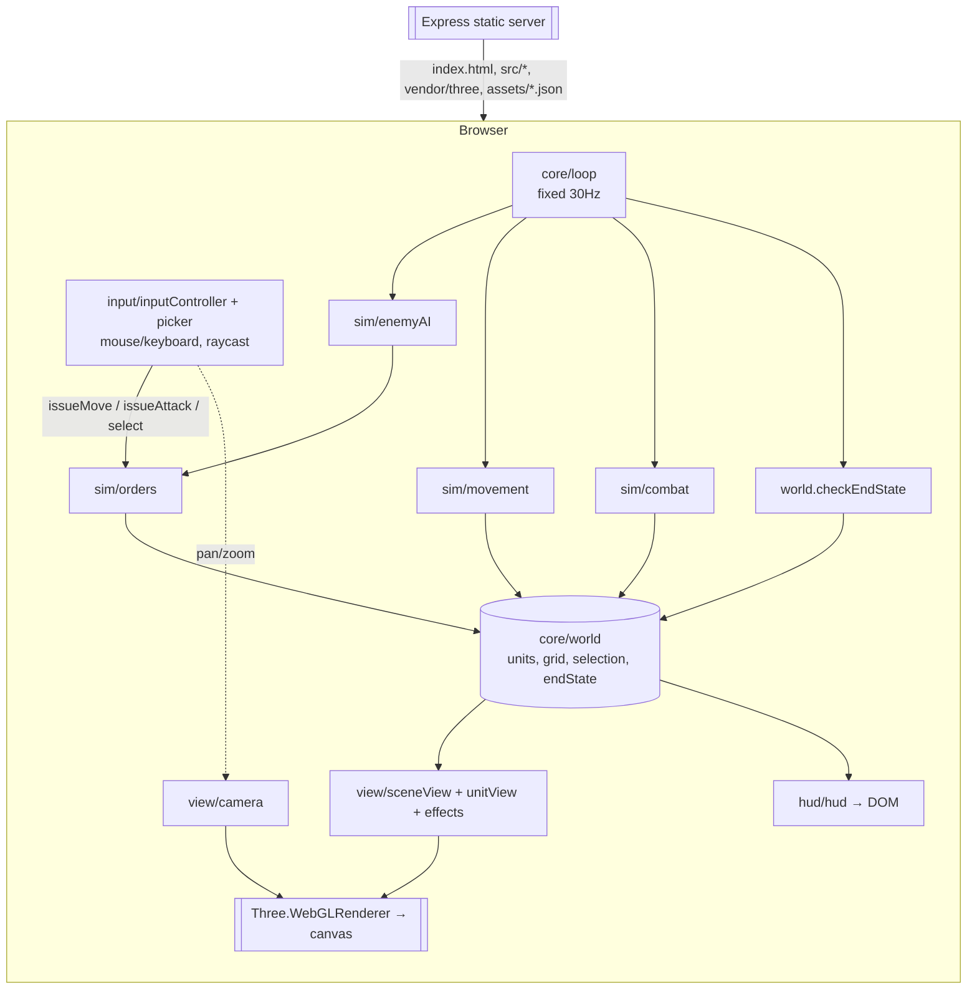

# Architecture: Warcraft Clone — Phase 1 (Single Skirmish Mission)

**Status:** Ready for Coding handoff
**Author:** Systems Architect
**Date:** 2026-10-08
**Companion docs:** `/workspace/git/warcraft-clone/docs/PRD.md`, `/workspace/git/warcraft-clone/docs/design.md`

This document settles every binding technical decision for Phase 1 so the Coding phase can start without re-litigating architecture. Where the PRD/design left an "implementation detail" open, this doc closes it. Section 11 lists assumptions made here.

**One-paragraph summary.** The entire game is a client-side ES-module app served statically by the existing Express server. Rendering is **Three.js** (vendored as a single `three.module.js`, no bundler). The simulation is a pure, Three-free core (entities as plain objects, a fixed-timestep loop, A\* on a baked grid) that is unit-testable in Node with the built-in `node:test` runner. The "enemy AI" is a 2-state machine that emits the *same* move/attack orders the player's input emits — there is no separate AI subsystem. The server, Dockerfile, compose, and `run.sh` stay as-is except for two tiny changes (ESM switch + a real test script).

---

## 1. Decision Summary (the load-bearing choices)

| # | Decision | Verdict |
|---|---|---|
| 1 | 3D rendering library | **Three.js** (vendored single ESM file, pinned ~r169) |
| 2 | Pathfinding | **A\*** over a **baked uniform grid** (8-connected, no corner-cutting); static obstacles only block; units do **not** path around each other (soft separation nudge + jittered arrival instead) |
| 3 | Game loop | **Fixed-timestep simulation (30 Hz)** via an accumulator inside `requestAnimationFrame`; render every frame; visual-only tweens run on wall-clock |
| 4 | Sim/render split | Pure Three-free `sim/` + `core/` modules; Three only in `view/`, `input/`. This is what makes logic testable in Node. |
| 5 | Enemy "AI" | 2-state machine (`idle-at-post` → `engage-and-leash`) that calls the **same** order/movement/combat primitives as the player |
| 6 | Build pipeline | **No build.** Native ES modules + `<script type="importmap">`. Three is a committed vendor file. |
| 7 | Server scaffold | Stays a static file server. Only changes: `"type":"module"` in `package.json`, `server.js` → ESM, real `test` script. |
| 8 | Test runner | Built-in **`node:test`** + `node:assert` — zero new dependencies |
| 9 | Deployment | Local **Docker Compose** for v1; cloud is a later phase only |

---

## 2. 3D Rendering Library

**Decision: Three.js.** CLAUDE.md already names it; here is the real rationale, not a rubber stamp, plus why the alternatives lose for *this* project.

### 2.1 Why Three.js fits Phase 1 exactly

This project needs only four things from a 3D library, and Three.js maps 1:1 onto all four:

1. **Low-poly primitive geometry** (capsules, boxes, discs, a ground plane). `CapsuleGeometry`, `BoxGeometry`, `CircleGeometry`, `PlaneGeometry` + `MeshStandardMaterial` cover every unit, prop, obstacle, and the terrain in the design doc. Zero asset pipeline required.
2. **Billboarded HP bars** (design §3.4 — "always face the camera"). Three.js `Sprite` is *intrinsically* camera-facing. An HP bar is a tiny `Sprite` (or a `Group` of two `Sprite`s for background + fill) parented above each unit. This is the single feature most likely to be fiddly in a lower-level setup, and Three gives it for free.
3. **Picking / raycasting for selection** (design §4.1 — click a unit, right-click resolves to unit-or-ground). `THREE.Raycaster` + `camera.setFromCamera(ndc)` does screen→unit picking and screen→ground-plane intersection out of the box. This is the core of the whole input layer.
4. **A fixed elevated camera with pan/zoom** (design §7.3). A `PerspectiveCamera` with a scripted, clamped position/look-at is trivial. We write ~40 lines of our own controller rather than pulling an addon (see §2.3).

### 2.2 Why not the alternatives

- **Babylon.js — rejected.** Babylon is excellent but its differentiators are exactly the "batteries" this MVP does not use: a built-in GUI system (we use a DOM HUD, design §1), a physics engine (no physics here), a full asset/material pipeline, and the in-browser Inspector. Those cost bundle size and surface area we would never touch. Babylon's monolithic default build is markedly heavier than Three's single module file, which works against the <5 s interactive-load NFR (PRD §6). For a primitives-only, DOM-HUD, no-physics game, Babylon is strictly more than we need.
- **Raw WebGL / regl — rejected.** Hand-writing a scene graph, raycasting, camera math, lighting, and billboarding is weeks of work that adds *zero* signal to the question Phase 1 exists to answer ("does the RTS loop feel good?"). This is explicitly the kind of speculative complexity CLAUDE.md's "Simplicity First" rule forbids.
- **PlayCanvas / Unity-WebGL / full engines — rejected.** Editor-centric engines impose an asset/project model and a much larger runtime; overkill for 12 capsules on a plane, and they fight the "plain static files served by Express" constraint.

### 2.3 Scope guardrails for the Three.js layer

- **Core only, no addons for MVP.** We write our own camera controller (fixed pitch/yaw + dolly zoom + clamped pan) instead of importing `OrbitControls` — OrbitControls allows rotation, which the PRD/design explicitly forbid (design §4.2), so writing ~40 lines is both simpler and more correct than disabling half of an addon.
- **Instancing/LOD are deferred.** With ≤12 units (PRD §6) plain `Mesh`es are fine. Only revisit if the 30 FPS floor is actually missed (PRD §9).
- **Version:** pin a specific recent stable release (this doc assumes **Three.js r169 / `0.169.0`**). The coding phase vendors `build/three.module.js` from that exact release and records the version in `public/vendor/README.md`. Do not float the version.

---

## 3. Pathfinding & Obstacle Avoidance

**Decision: A\* over a baked uniform grid, 8-connected, with corner-cutting disabled. Static obstacles block cells; units do not block each other in the pathfinder.**

### 3.1 Grid vs navmesh

Grid wins for this project and it is not close:

- The map is small, fixed, and hand-authored (PRD §4.1) with "a handful" of obstacles. A navmesh's advantage (compact representation of large open areas) is irrelevant at this size, and navmesh *generation* is real engineering we would have to write or import.
- The obstacle set is already authored as discrete placements in `map.json` (§8). Baking those into a boolean walkability grid is a dozen lines and trivially debuggable (you can `console.table` the grid).
- A\* on a grid is textbook, well-understood, and easy to unit-test deterministically. PRD §9 explicitly says "a well-known algorithm (A\*) is sufficient — no custom/novel pathfinding research needed." This honors that.

PRD §11 flags grid-vs-navmesh as an architecture call; **this is the call: grid.**

### 3.2 Grid spec

- World is the XZ ground plane (Y up). The map is `width × height` **tiles** of `tileSize` world units (defaults: 48×48 tiles, `tileSize = 1` → a 48×48 world-unit battlefield; tunable in `map.json`).
- One grid cell per tile → a 48×48 = 2304-cell boolean `walkable[]`. A\* over this for ≤12 units, recomputed only when an order is issued, is computationally free.
- **Baking:** at load, every cell starts walkable. For each obstacle in `map.json`, mark every cell whose center lies within the obstacle's `radius` (plus a half-unit unit-footprint margin so units don't clip into trunks) as blocked. Baked once; obstacles are static (PRD §4.1) so the grid never changes during play.

### 3.3 A\* details (so Coding doesn't guess)

- **Connectivity:** 8-connected (orthogonal + diagonal) for natural-looking movement.
- **Costs:** orthogonal step = 1, diagonal = √2 (≈1.414).
- **Heuristic:** octile distance (admissible for 8-connected), with a tiny tie-breaker (`h *= 1.0 + 1e-3`) to prefer straighter paths and cut the number of equal-cost nodes expanded.
- **No corner-cutting:** a diagonal move from A to B is only allowed if *both* orthogonally-adjacent cells shared by A and B are walkable. Prevents units slipping diagonally between two trees.
- **Path output:** a list of cell-center waypoints from start→goal.
- **Path smoothing (string-pulling):** after A\*, run a line-of-sight simplification — walk the waypoint list and drop any intermediate waypoint that is still reachable in a straight, obstacle-free line (grid supercover line check). Removes the "staircase" look cheaply. This is a small, high-value polish step; if time is tight it can ship without smoothing (units just zig-zag slightly), so it is **non-blocking**.

### 3.4 Unit-vs-unit avoidance (deliberately minimal)

PRD §4.4 / §7-4 and design §5.1 are explicit: **loose clustering is acceptable; no formation or flocking logic.** So:

- **Units are invisible to the pathfinder.** Only static obstacles block A\*. This avoids dynamic replanning, flow fields, and RVO — all out of scope.
- **Soft separation at the steering layer:** each sim tick, if two units are closer than a small separation radius, apply a gentle push-apart nudge to each (capped, so it never overpowers movement toward the goal). This keeps units from perfectly overlapping without any pathfinding cost. It is steering, not collision — units may briefly overlap and that is fine.
- **Jittered arrival:** a multi-unit move order sends each unit to a slightly offset point scattered in a small ring around the clicked destination (rather than all to the identical cell), so a group spreads into a loose blob instead of fighting over one tile.

### 3.5 Edge cases / stuck handling

- **Click on an obstacle or out of bounds → snap goal to nearest walkable cell** before pathing (design §4.1 "project to the nearest walkable point"). Pure function, unit-tested.
- **No path found** (goal fully enclosed, which the snap above makes rare): unit stays put and its order is cleared — never crash, never spin.
- **Arrival radius:** a unit stops when within an arrival threshold of its final goal (not pixel-exact — PRD US-3). Combined with jittered arrival, this prevents the "last cell" traffic jam.
- **Progress watchdog:** if a unit's distance to its current waypoint hasn't decreased for ~0.5 s (e.g. jammed by separation pushes near a chokepoint), it advances to the next waypoint or, if at the last, declares arrival and goes idle. Cheap insurance against the only realistic stuck source given units ignore each other in A\*.

---

## 4. Client-Side Data Flow & Module Structure

### 4.1 The golden rule (what makes everything else work)

> **Pure sim/logic modules import nothing from Three.js. Three lives only in `view/` and `input/`.**

The world state is plain JavaScript objects. Rendering reads that state each frame and reconciles a parallel set of Three objects. This separation is the reason the combat math, pathfinding, state machine, and order-resolution are unit-testable in plain Node with no DOM or WebGL (see §6). Treat any `import ... from 'three'` inside `sim/` or `core/` as a bug.

### 4.2 Coordinate system

- Simulation is **2D on the XZ plane** (`{x, z}`); Y is a fixed render-only up-axis. Units, pathfinding, combat, and distances all work in XZ. This keeps the math simple and keeps sim free of any 3D concept.
- The renderer places a unit at `(pos.x, groundY, pos.z)`. Terrain is flat (PRD §7-1), so `groundY` is constant.

### 4.3 The game loop — fixed timestep

```
const SIM_HZ = 30;
const DT = 1 / SIM_HZ;          // 33.3 ms sim step
let accumulator = 0, last = performance.now();

function frame(now) {
  requestAnimationFrame(frame);
  let elapsed = (now - last) / 1000; last = now;
  if (elapsed > 0.25) elapsed = 0.25;        // clamp after tab-away; avoid spiral of death
  accumulator += elapsed;

  while (accumulator >= DT) {
    world.update(DT);          // ← pure sim: AI → orders → movement → combat → removeDead → win/lose
    accumulator -= DT;
  }

  camera.update(elapsed);      // wall-clock: pan/zoom input
  sceneView.sync(world);       // reconcile Three objects to world state
  effects.update(elapsed);     // wall-clock: HP tweens, death fades, markers (visual only)
  hud.sync(world);             // reconcile DOM HUD to world state
  renderer.render(scene, camera);
}
```

**Why fixed timestep, not raw variable rAF:** combat ticks and movement must be frame-rate independent. On a 144 Hz machine a naive `pos += speed * frameDt` is fine, but `attackCooldown -= frameDt` summed over variable frames drifts, and a 30 FPS vs 144 FPS machine would deal damage at different *felt* rates without care. A fixed 30 Hz sim makes the simulation identical regardless of display refresh (PRD §6 wants 30 FPS floor / 60 goal; the sim runs at 30 Hz and the display renders as fast as rAF allows). Determinism is *not* required (PRD §6), so we keep it simple: no state interpolation between ticks for MVP — at 30 Hz with smooth per-tick movement the motion already looks fine. (Interpolation is a documented later-polish option.)

`world.update(DT)` runs these phases in order every tick:

```
1. enemyAI.step(world)        // sets orders on reactive enemies (see §4.6)
2. movement.step(world, DT)   // advance along paths + separation nudge + arrival
3. combat.step(world, DT)     // in-range? tick cooldown; expired? apply damage
4. world.removeDead()         // hp<=0 → mark dead, drop from active list
5. world.checkEndState()      // all enemies dead → WIN; all players dead → LOSE
```

### 4.4 Entity / unit data shape

A unit is a plain object (no class needed, but a factory is fine). Stats come from `units.json` (§8); runtime fields are mutated by the sim.

```js
{
  id: 7,                       // stable unique id
  faction: 'player',           // 'player' | 'enemy'
  type: 'ranged',              // 'melee'  | 'ranged'

  // --- stats (copied from units.json at spawn; per-enemy overrides allowed) ---
  maxHp: 30, dmg: 5, range: 4.0, speed: 3.0,
  attackInterval: 1.2,         // seconds between damage ticks
  aggroRadius: 6, leashRange: 8,

  // --- runtime sim state ---
  hp: 30,
  pos: { x: 40, z: 8 },
  state: 'idle',               // 'idle' | 'moving' | 'attacking' | 'dead'

  // orders (set by player input OR by enemyAI — same fields)
  path: [{x,z}, ...] | null,   // current A* waypoint list
  pathIndex: 0,
  moveGoal: { x, z } | null,   // final destination of current move
  attackTargetId: null,        // id of unit being attacked, or null

  // combat timing
  attackCd: 0,                 // seconds until next damage tick allowed

  // enemy-only reactive fields (ignored for players)
  spawnPos: { x: 40, z: 8 },   // leash anchor

  // watchdog
  stuckTimer: 0, lastDistToWaypoint: Infinity,
}
```

The world holds `units` (array/Map by id), the `grid` (walkability), map metadata, selection (`Set<id>`), and `endState` (`null | 'win' | 'lose'`). **No Three references anywhere in this object graph.**

### 4.5 Input → order resolution

`input/inputController.js` (Three-aware, owns the canvas DOM listeners) translates raw events into **orders**, which it applies via the pure `sim/orders.js` functions. Mapping follows design §4.1 exactly:

- **Left mouse down→up, moved <5px, ray hits a player unit** → `selectOnly(world, unitId)`.
- **Left down→up <5px on ground / obstacle / enemy** → `clearSelection(world)` (enemies are not left-selectable).
- **Left drag ≥5px** → draw a screen-space box; on mouse-up, select every **player** unit whose world position projects inside the box → `selectInBox(world, ids)`.
- **Right-click, ≥1 selected:**
  - ray hits an **enemy unit** → `issueAttack(world, selectedIds, enemyId)`.
  - ray hits anything else → `issueMove(world, selectedIds, groundPoint)` (ground point snapped to nearest walkable, §3.5).
- **Right-click, 0 selected** → no-op.
- **Scroll** → camera dolly zoom (clamped). **Arrows/WASD / edge-scroll** → camera pan (clamped).

**Picking** (`input/picker.js`) is the only place raycasting lives: `rayFromEvent(event) → { hitUnitId | null, groundPoint | null }`. It raycasts against the unit meshes first (nearest hit → that unit's id via `mesh.userData.unitId`), then against the ground plane for the move point. The *resolution* of a pick into an order (`issueMove`/`issueAttack`, nearest-walkable snap, move-vs-attack branch) is pure and tested without Three by feeding it a synthetic `{hitUnitId, groundPoint}`.

`issueMove` / `issueAttack` are the **single shared primitive** the enemy AI also calls — they set `path`/`moveGoal`/`attackTargetId`/`state` on a unit. Player input and AI both go through them; neither has its own movement or combat code.

### 4.6 Enemy "AI" — the 2-state machine (no separate subsystem)

Per PRD §2 this is *literally the same* movement/combat primitives, parameterized by a trigger. `sim/enemyAI.js` runs each tick over enemy units:

```
state IDLE (idle-at-post):
  if (took damage since last tick)  OR  (a player unit is within aggroRadius):
      attackTargetId = nearest player unit within aggroRadius (or the attacker)
      issueAttack(world, [this.id], attackTargetId)   // SAME primitive as player
      → state ENGAGE

state ENGAGE (engage-and-leash):
  if (target is dead/removed)            → disengage
  else if (distance(this.pos, spawnPos) > leashRange)  → disengage
  else:
      keep attacking: issueAttack re-affirms target; movement+combat steps do the rest

disengage:
  attackTargetId = null
  issueMove(world, [this.id], spawnPos)   // walk home, SAME primitive as player move
  → state IDLE  (resumes idling once home)
```

Key properties that keep this in scope:
- It sets the exact same order fields a player click would. `movement.step` and `combat.step` then act on those fields with no knowledge of *who* set them. There is no enemy-specific movement or combat code.
- "Took damage" is a per-tick flag `combat.step` sets on the victim; the AI reads and clears it. That is the entire trigger plumbing.
- Leash = a distance check against `spawnPos`. No patrol, no target-priority heuristic, no regroup — PRD §2 forbids all of those and this machine has no hook for them.

### 4.7 Rendering layer — reconciliation, not ownership

`view/sceneView.js` keeps a `Map<unitId, THREE.Group>` and each frame **reconciles** it to `world.units`:

- New unit id in world, none in view → build a unit `Group` (`view/unitView.js`): body capsule (type silhouette per design §3.2), faction ground disc (§3.1), selection ring (toggled by `world.selection`), billboarded HP `Sprite` (§3.4). Set `group.userData.unitId`.
- Existing → update position (`group.position.set(x, groundY, z)`), HP fill width/color, selection-ring visibility, faction already static.
- Unit gone from world (dead) → hand off to `view/effects.js` for the scale-to-zero + fade (design §3.5), then dispose the Group (geometry/material disposal to avoid GPU leaks).

`view/effects.js` owns all purely-cosmetic, wall-clock-timed animations so they never touch sim: HP-bar tween (~150 ms, design §3.4), move marker (§5.1), pulsing attack-target ring (§5.2), death fade (§3.5), optional floating damage numbers / selection-ring pulse (both flagged non-blocking in design).

`hud/hud.js` reconciles the DOM HUD (design §1.3) to world state each frame: status readout counts (`Enemies X/Y`, `Your Units X/Y`), the up-to-6 selection slots with mini HP bars, and the win/lose overlay (shown when `world.endState` is set). The HUD is **read-only over the world** — it never mutates sim state; clicks on units happen in the 3D canvas, not the HUD (the optional "click a panel slot to reselect" is a later nice-to-have per design §2).

### 4.8 Module / file tree (under `public/`)

```
public/
  index.html              # canvas + HUD DOM skeleton (design §1.3) + importmap + <script type=module src=src/main.js>
  styles.css              # HUD styling, palette & cursors from design §4.3/§7
  vendor/
    three.module.js       # committed Three r169 build (the ONLY vendored lib)
    README.md             # records the exact Three version + source URL
  assets/
    map.json              # terrain size, obstacles, player+enemy placements (§8)
    units.json            # per-type stats (§8)

  src/
    main.js               # bootstrap: fetch config → build world → build view → start loop
    config.js             # fetch + parse + validate map.json / units.json

    core/                 # orchestration (may touch neither Three nor DOM)
      loop.js             # fixed-timestep accumulator (§4.3)
      world.js            # entity store, spawn(), removeDead(), checkEndState(), selection
      units.js           # unit factory: merges units.json stats + placement into the §4.4 shape

    sim/                  # PURE. No Three, no DOM. 100% unit-tested (§6)
      vec2.js             # {x,z} math helpers (add, sub, len, normalize, dist)
      grid.js             # bake walkability from map.json; world<->cell conversion; nearest-walkable
      pathfinding.js      # A* (§3.3) + string-pull smoothing
      orders.js           # issueMove / issueAttack / selectOnly / selectInBox / clearSelection; move-vs-attack resolution
      movement.js         # step(): advance along path, separation nudge, arrival, watchdog
      combat.js           # step(): range check, cooldown tick, damage, death flag
      enemyAI.js          # step(): the 2-state machine (§4.6), emits via orders.js

    view/                 # Three-aware only
      sceneView.js        # scene, renderer, lights, ground, obstacles; reconcile units (§4.7)
      unitView.js         # build/update one unit Group (body, disc, ring, HP sprite)
      effects.js          # wall-clock cosmetic animations (tweens, markers, fades)
      camera.js           # fixed pitch/yaw PerspectiveCamera; dolly zoom + clamped pan

    input/                # Three-aware only
      picker.js           # raycaster: event → { hitUnitId, groundPoint }
      inputController.js  # DOM listeners → orders (§4.5); box-select rectangle; cursor states

    hud/
      hud.js              # reconcile DOM HUD (status, selection panel, overlay) from world (§4.7)
```

### 4.9 Data-flow diagram



---

## 5. Build Pipeline

**Decision: no build step. Native ES modules + an HTML import map. Three.js is vendored as one committed file.**

### 5.1 How the frontend loads

`index.html` declares an import map so `import ... from 'three'` resolves to the vendored file, then loads the app as a module:

```html
<script type="importmap">
  { "imports": { "three": "/vendor/three.module.js" } }
</script>
<script type="module" src="/src/main.js"></script>
```

Every file in `src/` is a native ES module using relative imports (`import { aStar } from './pathfinding.js'`) and bare `'three'` only in `view/` and `input/`. The browser loads the graph directly; Express serves each file as-is.

### 5.2 Why no bundler (and when to revisit)

- **Simplicity (CLAUDE.md core rule).** A bundler (Vite/esbuild/Rollup) adds dev dependencies, a `dist/` to manage, and a build phase that must run inside Docker before the server can serve anything. For an MVP that ships ~1 MB of vendored Three once (cached thereafter) plus a handful of small hand-written modules, that machinery earns nothing.
- **It keeps the live-edit dev loop working.** `docker-compose.yml` already bind-mounts `.:/app`. With no build, editing a file in `src/` and refreshing the browser is the entire inner loop — a bundler would require a watcher/HMR process inside the container to preserve that, i.e. strictly more moving parts.
- **Node can import the same files for tests.** Because sim modules are plain ESM with no Three import, `node:test` imports them directly (§6). A bundler would add a transform step between "what runs in the browser" and "what the tests import" for no benefit.
- **The <5 s load NFR is met.** Three r169 `three.module.js` is a single request; over local Docker it is instant, and over broadband it is well under budget. If it ever isn't, the cheapest fix is one line of Express `compression` middleware (gzip), not a bundler. No minification is needed for MVP.
- **Revisit a bundler only if** Phase 2 introduces TypeScript, many Three addons/examples needing tree-shaking, or a real asset pipeline. None apply to Phase 1.

**Vendoring Three (not npm-at-runtime):** `public/vendor/three.module.js` is committed to the repo (it is plain text; ~1 MB, one-time). This makes the browser app dependency-free and the static server trivially correct — nothing to install or copy at container start. `public/vendor/README.md` records the exact release and the source URL so the version is auditable and updatable. Three is therefore **not** a `package.json` dependency (it is a browser asset, and the tests don't need it).

### 5.3 Does the build pipeline change `run.sh` / Docker?

No build phase is introduced, so:
- **`run.sh build`** keeps its current meaning — `docker compose build` (build the *image*), not an asset build. No change needed.
- **`run.sh start` / `logs` / `shell` / `clean`** — unchanged.
- **`run.sh test`** already runs `docker compose run --rm app npm test`; it starts working for real once the `test` script is wired up (§6). No change to `run.sh` itself.
- **Dockerfile / docker-compose.yml** — unchanged (details in §6/§7).

---

## 6. Server Scaffold Fit

**The server stays exactly what it is today: a static file server. No gameplay logic, no state, no database (PRD §6).** `app.use(express.static('public'))` already serves `index.html`, `src/*`, `vendor/*`, `styles.css`, and `assets/*.json`. That is the whole backend.

Only three small changes are needed, all to support browser/Node ESM parity — none add backend behavior:

1. **`package.json`: add `"type": "module"`.** This makes every `.js` an ES module in Node, so the tests (`node:test`) import the *same* `src/sim/*.js` files the browser runs — no `.mjs` renaming, no dual CJS/ESM copies. Also wire the real test script (§7.2).
2. **`server.js` → ESM.** It is 11 lines; convert `require` to `import` (`import express from 'express'; import path from 'node:path'; import { fileURLToPath } from 'node:url';` + derive `__dirname`). Behavior is identical: still `express.static('public')` on `PORT`. This is the only code change to the server, and it is forced solely by the `"type":"module"` switch.
3. **(Optional, non-blocking) a `GET /health` → `200 "ok"`** for a Docker healthcheck and uptime pings. Pure convenience; leave out if not wanted — it changes nothing about the game.

**Dockerfile:** unchanged. `FROM node:20-alpine` → `npm install` (installs only Express) → `COPY . .` → `npm start`. Node 20 supports ESM and ships `node:test`, so nothing new is required.

**docker-compose.yml:** unchanged. The `.:/app` bind mount already gives live-edit of `public/` with no rebuild. (`env_file: .env` stays; the app reads only `PORT`.)

**No new runtime dependencies.** Express remains the only production dependency; Three is a committed vendor asset, and the test runner is built into Node.

---

## 7. Testing Strategy

The sim/render split (§4.1) is what makes meaningful automated testing possible on a Node-only stack with zero DOM/WebGL. Test what is pure; verify the rest by eye.

### 7.1 Unit-testable (automated, Node, no browser)

Everything in `sim/` plus the pure parts of `core/` is deterministic and framework-free:

| Module | What to assert |
|---|---|
| `sim/vec2` | distance, normalize, add/sub correctness |
| `sim/grid` | obstacle baking blocks the right cells; world↔cell conversion; nearest-walkable snaps a blocked/out-of-bounds point to the correct walkable cell |
| `sim/pathfinding` | A\* finds the shortest path on a known grid; routes **around** a blocking obstacle (not through); refuses corner-cutting between two diagonal blockers; returns empty/`null` when enclosed; smoothing never produces a path that crosses a blocked cell |
| `sim/orders` | right-click-on-enemy → attack order; right-click-on-ground → move order with goal snapped to nearest walkable; box-select includes only player units inside the rect and never enemies; clear/select-only mutate selection correctly |
| `sim/combat` | damage applied only when target in range; melee needs adjacency, ranged hits from range; cooldown gates ticks (no double-tick in one interval); hp reaches 0 → death flag set; attacker whose target died stops cleanly (no throw) |
| `sim/enemyAI` | idle enemy with no player in aggro stays idle; player entering aggroRadius → engage + attack order set; taking damage while idle → engage even if attacker is outside aggro; target beyond leashRange from spawn → disengage + move-home order; target death → disengage |
| `core/world` | `removeDead` drops `hp<=0` units and frees them from selection/targeting; `checkEndState` returns `win` only when all enemies dead, `lose` only when all players dead, `null` otherwise (incl. the exact last-unit boundary of PRD US-7/US-8) |

These tests construct a `world` with hand-placed units and a known grid, run one or more `update(DT)` ticks, and assert on plain-object state. No mocking of Three or the DOM is needed because none is imported.

### 7.2 Test runner

**Built-in `node:test` + `node:assert/strict`.** Rationale: it ships with Node 20 (already the Docker base image), so **zero new dependencies**, which fits the Node-only / minimal-footprint stack better than adding Jest or Vitest (both of which would also need ESM/transform config). Layout:

```
test/
  pathfinding.test.js
  combat.test.js
  enemyAI.test.js
  orders.test.js
  grid.test.js
  world.test.js
```

`package.json`: `"test": "node --test test/"`. `run.sh test` already calls `npm test` inside the container, so `./run.sh test` runs the suite with no other change. CLAUDE.md requires tests to pass before committing — this makes that a one-command gate.

### 7.3 Manual / visual verification (not automated for MVP)

These need a human (or, later, a headless-browser smoke test) because they are about rendering, feel, and GPU behavior:

- Raycast picking accuracy (does clicking a capsule actually select *that* unit at various zoom levels), box-select rectangle correctness on screen.
- Camera feel: pan/zoom clamps stay within map bounds; dolly zoom min/max (design §7.3).
- Billboarded HP bars always face camera; HP tween/color thresholds; death scale-fade; move marker; pulsing attack ring; cursor state changes (design §4.3).
- Performance: holds ≥30 FPS (60 goal) with the full roster fighting (PRD §6). Spot-check in Chrome/Firefox/Edge (design/PRD browser matrix).
- The end-to-end loop: select → move around an obstacle → attack a camp unit → camp reacts and leashes → win/lose overlay fires on the last kill.

A headless Playwright smoke test (load page, assert canvas present and no console errors) is a reasonable **later** addition but is out of scope for Phase 1 and would add a heavy dev dependency; it is explicitly deferred.

---

## 8. API Contracts & Data Formats

### 8.1 HTTP surface (all static, all GET)

| Route | Returns | Notes |
|---|---|---|
| `GET /` | `index.html` | the only HTML page |
| `GET /styles.css`, `GET /src/**/*.js`, `GET /vendor/three.module.js` | static assets | served by `express.static` |
| `GET /assets/map.json` | map config (below) | fetched once by `config.js` at load |
| `GET /assets/units.json` | unit stats (below) | fetched once by `config.js` at load |
| `GET /health` *(optional)* | `200 "ok"` | non-gameplay healthcheck only |

No POST/PUT/WS, no auth, no sessions, no dynamic responses — consistent with PRD §6 ("server does not run game logic / track state / need a database").

### 8.2 `assets/map.json`

All positions are in **world units** (XZ). The grid is derived from `width`/`height`/`tileSize` (§3.2). Example (stats shown are illustrative; tunable per PRD §7-7):

```json
{
  "name": "Skirmish Valley",
  "tileSize": 1,
  "width": 48,
  "height": 48,
  "ground": { "color": "#5A6B47", "dirtColor": "#7A6450" },
  "obstacles": [
    { "type": "tree", "x": 18, "z": 22, "radius": 1.0 },
    { "type": "tree", "x": 20, "z": 23, "radius": 1.0 },
    { "type": "rock", "x": 30, "z": 14, "radius": 1.5 }
  ],
  "players": [
    { "type": "melee",  "x": 6,  "z": 40 },
    { "type": "melee",  "x": 8,  "z": 42 },
    { "type": "ranged", "x": 5,  "z": 44 },
    { "type": "ranged", "x": 9,  "z": 45 }
  ],
  "enemies": [
    { "type": "melee",  "x": 40, "z": 8 },
    { "type": "melee",  "x": 42, "z": 7 },
    { "type": "ranged", "x": 44, "z": 6, "aggroRadius": 7, "leashRange": 10 },
    { "type": "ranged", "x": 41, "z": 10 }
  ]
}
```

- `obstacles[]`: `type` drives visual (tree=dark-green, rock=grey per design §7.1); `radius` drives both the mesh size and the cells baked as blocked (§3.2).
- `players[]` / `enemies[]`: `type` selects the stat block from `units.json`; `x`/`z` is the spawn (and, for enemies, the `spawnPos` leash anchor).
- Enemy entries **may** override `aggroRadius` / `leashRange` per unit; if omitted they inherit the type defaults from `units.json`.
- Rough roster size 4–6 per side (PRD §4.2); this file is the single source of placement truth.

### 8.3 `assets/units.json`

```json
{
  "melee":  { "maxHp": 50, "dmg": 8, "range": 1.2, "speed": 3.0, "attackInterval": 1.0, "aggroRadius": 5, "leashRange": 8 },
  "ranged": { "maxHp": 30, "dmg": 5, "range": 4.0, "speed": 3.0, "attackInterval": 1.2, "aggroRadius": 6, "leashRange": 8 }
}
```

- `range` is in world units (melee ~1.2 ≈ "adjacent"; ranged 4.0 per PRD §4.2).
- `speed` in world units/second; `attackInterval` in seconds between damage ticks (combat is damage-over-time, PRD §4.5).
- `aggroRadius` / `leashRange` are the enemy reactive parameters (§4.6); on player units they are simply unused.
- These numbers are explicitly tunable during implementation (PRD §7-7); the schema is the binding contract, not the values.

`config.js` validates on load (required keys present, counts 4–6 per side, every spawn inside bounds and on a walkable cell) and fails loudly to the console if the data is malformed — cheaper to catch here than as a mid-game NaN.

---

## 9. Deployment Strategy

**v1: local Docker Compose only** — consistent with every other project in this workspace. `./run.sh start` → `docker compose up -d` builds the image, runs Express on port 8000, bind-mounts the repo for live-edit. There is no backend state, DB, queue, or external service to provision; a single container is the whole deployment.

- **Scaling / infra:** none required. One stateless static-file container. Monitoring beyond container logs (`./run.sh logs`) and the optional `/health` endpoint is out of scope at this phase.
- **Config:** the only runtime env var is `PORT` (via `.env`); gameplay "config" is the static JSON in `assets/`, requiring no server restart to change — just edit and refresh.
- **Cloud is a later phase only.** Because the whole app is static files + a thin Express shim, a future cloud step is trivial (any static host/CDN, or the same container on a small PaaS) — but it is explicitly **not** in Phase 1 scope and no cloud-specific decisions are made here.

---

## 10. Implementation Order (for the Coding phase)

Build bottom-up so each layer is testable before the one above depends on it:

1. **Scaffold ESM switch** — `"type":"module"` + `server.js` to ESM + `test` script; confirm `./run.sh start` still serves `index.html`. *(verify: page loads)*
2. **Vendor Three** — commit `vendor/three.module.js` + import map; a throwaway `main.js` renders a spinning cube. *(verify: cube on screen)*
3. **`sim/` core, test-first** — `vec2`, `grid`, `pathfinding`, `orders`, `combat`, `enemyAI`, plus `core/world`. *(verify: `./run.sh test` green — this is the riskiest logic, PRD §9, so it is validated with no rendering in the way)*
4. **`view/` + `core/loop`** — scene, ground, obstacles, unit Groups reconciled from a static world; fixed-timestep loop moving units along hard-coded paths. *(verify: units visibly path around an obstacle)*
5. **`input/` + camera** — picking, select/box-select, right-click move-or-attack, pan/zoom. *(verify: click-move-attack works by hand)*
6. **`hud/` + `effects`** — status readout, selection panel, HP bars/tweens, markers, rings, death fade, win/lose overlay. *(verify: full loop + win/lose per US-7/US-8)*

Highest-risk areas to test hard (PRD §9): pathfinding around obstacles (step 3, unit tests), and the reactive-AI leash not drifting into "real AI" (step 3 state-machine tests + the §4.6 constraint that it may only call `issueMove`/`issueAttack`).

---

## 11. Assumptions Made Here

Beyond PRD §7 and design §8, this architecture assumes:

1. **30 Hz fixed sim** is a fine default; it is a one-line change if play-testing wants 20 or 60. Not determinism-critical (PRD §6).
2. **Grid 48×48 @ tileSize 1** is a starting size; the real numbers live in `map.json` and can change without code changes.
3. **No inter-unit pathfinding collision** (units ignore each other in A\*, soft-separate at steering) — a direct reading of PRD §4.4/§7-4 and design §5.1.
4. **Three r169 / 0.169.0** is the pinned release; the coding phase may bump to the latest stable at implementation time but must pin a specific version and record it in `vendor/README.md`.
5. **No state interpolation between sim ticks** for MVP; motion at 30 Hz is smooth enough. Interpolation is a documented later-polish lever if needed.
6. **`compression` middleware is not added** unless the <5 s load NFR is actually missed; local Docker makes it moot.
7. Committing a ~1 MB vendored Three file to git is acceptable (standard vendoring; one-time cost).

---

*End of architecture document.*

